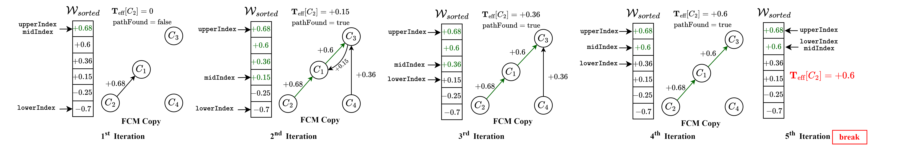

# TCEC-FCM: Efficient Algorithms for Total Causal Effect Calculation in Fuzzy Cognitive Maps
[](https://www.mathworks.com/products/matlab.html)


## Table of Contents
1. [General Info](#general-info)
2. [Abstract](#abstract)
3. [Pseudocode](#pseudocode)
4. [Source Code](#sourcecode)
5. [Installation and Usage](#installation-and-usage)
6. [Citation](#citation)
7. [License](#license)
8. [Contact](#contact)
9. [Acknowledgement](#acknowledgement)

### General Info
***
This repository contains the source code developed and used in the paper: *"Advancing Explainable AI with Causal Analysis in Large-Scale Fuzzy Cognitive Maps"* written by **Marios Tyrovolas**, **Nikolaos D. Kallimanis**, and **Chrysostomos Stylios**. 
***

<p align="center">

</p>

### Abstract
***
In the quest for accurate and interpretable AI models, eXplainable AI (XAI) has become crucial. Among its tools, Fuzzy Cognitive Maps (FCMs) stand out for their ability to exploit both expert knowledge and data-driven insights, providing transparency and intrinsic interpretability. This letter introduces the Total Causal Effect Calculation for FCMs (TCEC-FCM) algorithm, an innovative approach that, for the first time, enables the efficient calculation of total causal effects between concepts in large-scale FCMs by leveraging binary search and Breadth-First Search technique, thereby overcoming the challenge of exhaustive causal path searches that hinder existing methods. Our evaluation across various synthetic FCMs demonstrates TCEC-FCM's superior performance over exhaustive methods, marking a significant advancement in causal effect analysis within FCMs, thus broadening their usability in XAI applications.
***

## Pseudocode

Detailed pseudocode for TCEC-FCM-LS and TCEC-FCM-BS Algorithms is provided for a clearer understanding of the implementation:
1. [TCEC-FCM Pseudocodes](https://github.com/marios-tyrovolas/TCEC-FCM-Algorithms/blob/main/TCEC_FCM_Pseudocodes.pdf)


## Source Code

Complete source code for all algorithms is available, enabling users to explore, test, and apply these methods in various FCM scenarios. Access it in the [Source Code](https://github.com/marios-tyrovolas/TCEC-FCM-Algorithms/tree/main/Source%20Code) folder.

The provided algorithms include:
* TCEC-FCM-LS and TCEC-FCM-BS Algorithms
* DFSB-FCM Algorithm

## Installation and Usage

To use these algorithms, simply ensure you have MATLAB installed on your system, preferably the latest version for optimal compatibility and performance. No additional installation steps are required. Simply download the source code and open it in MATLAB to begin.

## Citation

While this paper is under review, please cite this work as follows:


```
Tyrovolas, M., Kallimanis, N. D., & Stylios, C. (2024). Advancing Explainable AI with Causal Analysis in Large-Scale Fuzzy Cognitive Maps. Submitted to IEEE Systems, Man, and Cybernetics Letters
```
**Note:** This citation will be updated once the paper is officially published.

## License
***
This work is licensed under the Creative Commons Attribution-NoDerivatives 4.0 International (CC BY-ND 4.0) License. Under this license, you are free to share and use this work as long as you provide attribution to the original authors and do not modify the material in any way.

For more details, see the full license [here](https://creativecommons.org/licenses/by-nd/4.0/).

### Contact

For any question, please raise an issue or contact

```
Marios Tyrovolas: tirovolas@kic.uoi.gr
```
### Acknowledgement

This research has been financed by the European Union: Next Generation EU through the Program Greece 2.0 - National Recovery and Resilience Plan, under the call "Flagship actions in interdisciplinary scientific fields with a special focus on the productive fabric”, project name "Greece4.0 - Network of Excellence for developing, disseminating and implementing digital transformation technologies in Greek Industry" (project code: TAEDR-0535864).

